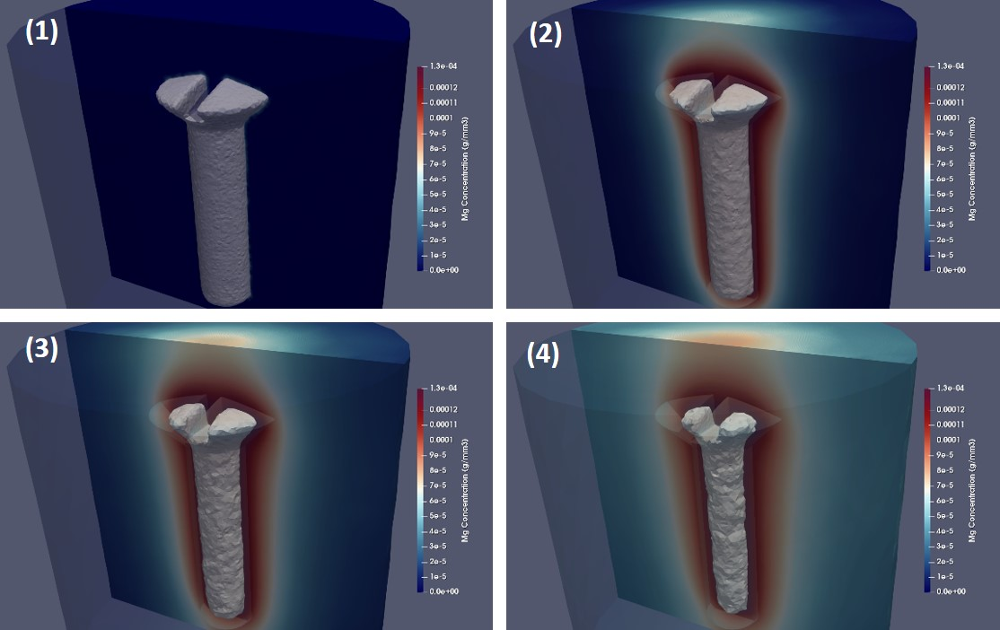

# BioDeg, a biodegradation and corrosion simulation code for metallic materials

## About

This repository contains the source code of BioDeg, a code for simulating the  biodegradation and corrosion behavior of metallic materials.

The developed model captures the release of metallic ions, changes in pH, the formation of a protective film, the dissolution of this film in presence of different ions, and the effect of perfusion of the surrounding fluid. This has been accomplished by deriving a system of time-dependent reaction-diffusion-convection partial differential equations from the underlying oxidation-reduction reactions. The level set formalism is employed to track the biodegradation interface between the material and its surroundings. The equations were solved implicitly using the finite element method for spatial terms (with a 1st order Lagrange polynomial as the shape function) and the backward-Euler finite difference method for temporal terms on an Eulerian mesh.

Tracking the moving corrosion front at the diffusion interface requires high numerical accuracy of the diffusive state variables, which is commonly achieved using a refined computational grid. This makes the model computationally intensive and in need of parallelization (the models usually have 10-20 millions of elements in 3D). The parallel algorithm is implemented using a domain decomposition method (restricted additive Schwarz). Beside this, the formed linear system of equations in each partition of the mesh is solved using Krylov methods by taking advantage of the highly-efficient preconditioners and iterative solvers of the PETSc library.

For more details about the mathematical and computational models, please refer to the published works.

## Publications and referencing

This code has been used in the following publications so far. In scientific works, where results to some extent are obtained using BioDeg, please cite the following articles:

    @misc{barzegari2020highly,
          title={Highly scalable numerical simulation of coupled reaction-diffusion systems with moving interfaces},
          author={Mojtaba Barzegari and Liesbet Geris},
          year={2020},
          eprint={2008.11057},
          archivePrefix={arXiv},
          primaryClass={cs.CE}
    }

    @misc{barzegari2021computational,
        title={Computational modeling of degradation process of biodegradable magnesium biomaterials},
        author={Mojtaba Barzegari and Di Mei and Sviatlana V. Lamaka and Liesbet Geris},
        year={2021},
        eprint={2102.10064},
        archivePrefix={arXiv},
        primaryClass={cs.CE}
    }

## Getting started

The code is implemented in FreeFEM, a domain-specific language for finite element computing. So, a parallel version of FreeFEM should be installed. A proper MPI runtime is required to run parallel FreeFEM (such as OpenMPI or MPICH). The PETSc module should also be installed and linked to FreeFEM (which is usually the default config for installing/compiling FreeFEM). The installation procedure can be found [here](https://doc.freefem.org/introduction/installation.html) for different platforms.

After installing the required software packages, the code can be run like this:

`$ mpirun -n 4 FreeFem++-mpi src/main.edp -v 0`

You can specify the number of employed cores (which also implies the number of mesh sub-partitions) by the `-n` switch (it is 4 in this example). The `-v 0` switch is used to suppress the verbosity of FreeFEM. The configs (such as the input mesh or the output location) can be modified in the source file `parameters.idp`.
